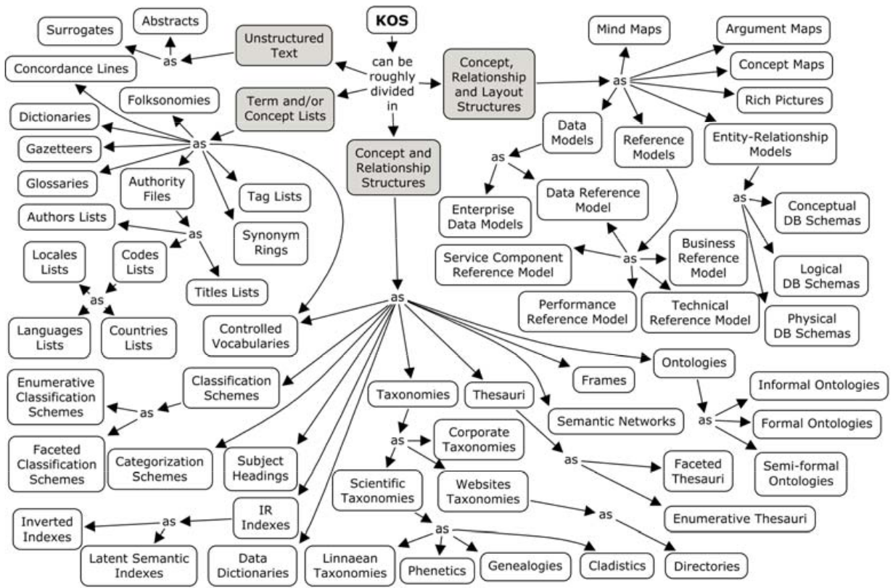
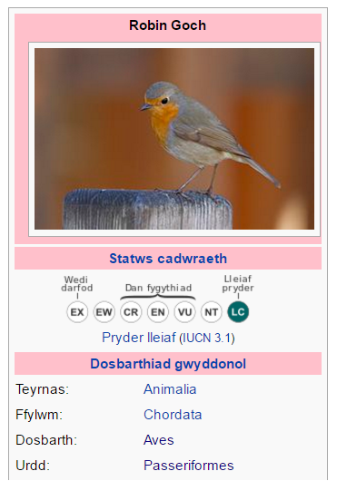
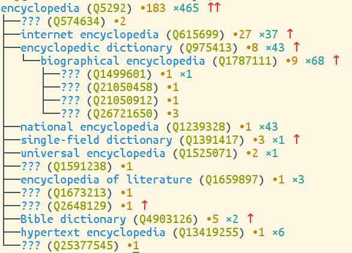
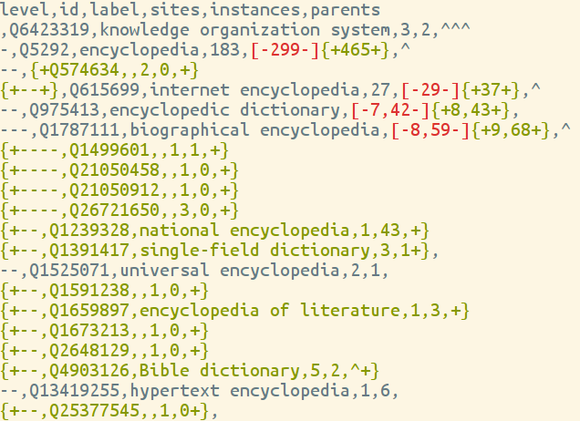
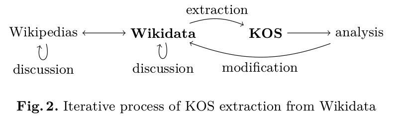
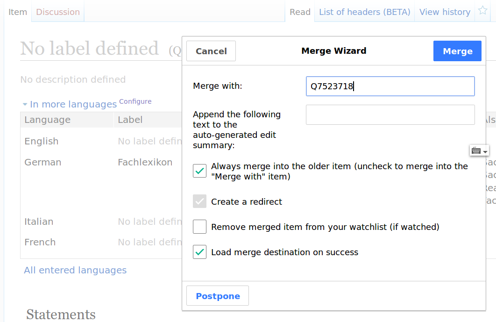
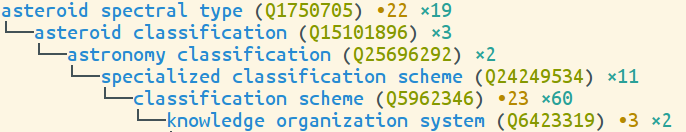
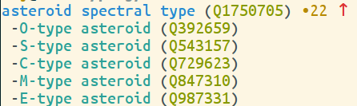
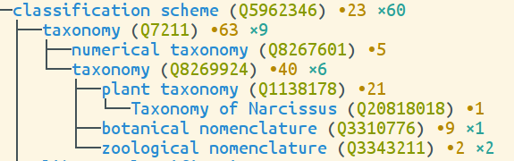
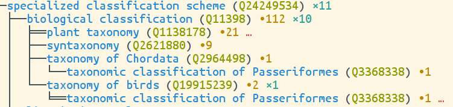

---
title: |
  Classification of \
  Knowledge Organization Systems\
  with Wikidata
shorttitle: KOS classification with Wikidata
author:
    name: Jakob Voß
institute: Verbundzentrale des GBV (VZG), Göttingen, Germany
date: 2016-09-09 # 10:00-10:45
subtitle: '[10.5281/zenodo.61767](http://dx.doi.org/10.5281/zenodo.61767)'
place: 15^th^ European NKOS Workshop, Hannover
nocite: |
  @Voss2016
...

## Overview

1. Typology of Knowledge Organization System
2. Wikidata Introduction
3. KOS classification in Wikidata
4. Challenges
5. Summary and Outlook

# 1 \newline Typology of \newline Knowledge Organization Systems

## Established KOS types

@Bratkova2014 compare eight typologies from literature, standards, and
KOS registries. All of them include:

* Classification schemes
* Ontologies
* Taxonomies
* Thesauri

## Other common KOS types

@Bratkova2014, @KOSTypes2015:

* Subject Heading Schemes
* Name Authority Lists
* Glossaries
* Gazetteers
* Dictionaries 
* Categorization Schemes
* Synonym Rings
* Semantic Networks
* Terminologies
* (Contolled/Structured) Vocabularies
* Schemas/Data Models
* Lists

## Taxonomy of KOS

@Souza2010 include a taxonomy:

{width=90%}

## Summary and findings

*"we are far from having a consensus on KOS taxonomies and the related terminology"* [@Souza2010]

* Several division criteria exist [@Bratkova2014]:
    * **semantic strength**
    * organization unit
    * domain
    * knowledge representation
    * type of vocabulary
    * open/closed world
    * granularity
    * format
    * purpose

* Proposed typologies rarely populated with KOS instances (!)

## Exception: BARTOC terminology registry

The [Basel Register of Thesauri, Ontologies & Classifications](http://bartoc.org) (<http://bartoc.org>), around 1.900 KOS instances with their DCMI NKOS KOS Types [@Ledl2016]: 

---------------------- ---- ----------------------- ---
classification scheme   751 name authority list      56
thesaurus               630 dictionary               54
glossary                183 list                     22
ontology                131 gazetteer                 6
subject heading scheme   61 categorization scheme     5
taxonomy                 59 semantic network          5
terminology              58 synonym ring              1
---------------------- ---- ----------------------- ---

208 KOS instances are linked to Wikidata and back!

# 2 \newline Wikidata Introduction \newline with focus on KOS

## What is Wikidata?

* Much like Wikipedia but database instead of encyclopedia
    * Also run by Wikimedia Foundation
    * Same software (MediaWiki) + Wikibase extension
    * It's also a Wiki (versioned database)
    * Collaboratively edited and freely usable

{width=5cm}

## Wikidata's goals

*Structure the sum of all human knowledge!*

1. Centralize links between Wikipedia language editions
  
    ------- ------------------------------
    Q48473  = library classification (en)
            = Bibliotheksklassifikation (de)
            = classificazione bibliotecaria (it)
            = ...
    ------- ------------------------------

    $\Longrightarrow$ controlled vocabulary with definitions

2. Centralize Infoboxes
3. Provide an interface for rich queries

    $\Longrightarrow$ rich knowledge base or semantic network

## Wikidata bits and pieces

* **Items** (`Q...`) 
    * e.g. [Q48473](http://www.wikidata.org/entity/Q48473) "library classification"
    * can be created and edited by anyone

* **Properties** (`P...`)
    * e.g. [P25](http://www.wikidata.org/entity/P25) "mother"
    * e.g. [P1103](http://www.wikidata.org/entity/P1103) "number of railway station platform tracks"
    * creation after community consensus

* normal **wiki pages** (discussion, help...)
    * e.g. <http://www.wikidata.org/wiki/Wikidata:Project_chat>

## Wikidata statements

* Simplified **statement**
    * item: [Q856638](http://www.wikidata.org/entity/Q856638) "library catalog"
    * property: [P279](http://www.wikidata.org/entity/P279) "subclass of"
    * value: [Q2352616](http://www.wikidata.org/entity/Q2352616) "catalog"

* Optional parts of a statement
    * **qualifiers** (e.g. valid from... until...)
    * **references** (e.g. as stated in ...)
    * **rank** (normal, preferred, deprectated, best)

## Infoboxes: Wikidata $\rightarrow$ Wikipedias

{height=6.5cm} 

## Queries

Public SPARQL endpoint at <https://query.wikidata.org/>

    # get subclasses (P279) of "catalog" (Q2352616)
    SELECT ?c WHERE { ?c wdt:P279 wd:Q2352616 }

Easier queries and integration into Wikipedia planned.

## Wikidata and Knowledge Organization Systems

* Wikidata **is a KOS** with notations, multilingual labels, 
  scope notes, definitions, and rich connections between concepts.

* Wikidata **contains mappings** to many other KOS, e.g.
    * e.g. [P227](http://www.wikidata.org/entity/P227) "GND identifier"
    * e.g. [P1036](http://www.wikidata.org/entity/P1036) "DDC notation"
    * ... (> 40% of all properties!)

## Wikidata as Knowledge Organization System

* Wikidata **items** correspond to KOS concepts
* Some Wikidata **properties** correspond to\
  typical KOS relationship types:
    * [P279](http://www.wikidata.org/entity/P279) "subclass of"
    * [P31](http://www.wikidata.org/entity/P31) "instance of"
    * [P361](http://www.wikidata.org/entity/P361) "part of"
    * ...

* Not applied consistently!
* Semantics not as strict as wished by computer science\
  @Spitz2016, @Brasileiro2016, ...

# 3 \newline Managing a KOS typology in Wikidata

## Extract KOS subclasses and instances

[P279](http://www.wikidata.org/entity/P279) "subclass of"
[Q6423319](http://www.wikidata.org/entity/Q64233198) "knowledge organization system"

* **SPARQL**
    * See full query in the paper [@Voss2016]

* **wdtaxonomy**

    * `wdtaxonomy Q6423319`
    * <https://github.com/nichtich/wikidata-taxonomy>

## `wdtaxonomy Q5292`

{width=90%}

## `wdtaxonomy --format csv Q5292`

\scriptsize

~~~
level,id,label,sites,instances,parents
,Q5292,encyclopedia,183,465,^^
-,Q574634,,2,0,
-,Q615699,internet encyclopedia,27,37,^
-,Q975413,encyclopedic dictionary,8,43,^
--,Q1787111,biographical encyclopedia,9,68,^
---,Q1499601,,1,1,
---,Q21050458,,1,0,
---,Q21050912,,1,0,
---,Q26721650,,3,0,
-,Q1239328,national encyclopedia,1,43,
-,Q1391417,single-field dictionary,3,1,^
-,Q1525071,universal encyclopedia,2,1,
-,Q1591238,,1,0,
-,Q1659897,encyclopedia of literature,1,3,
-,Q1673213,,1,0,
-,Q2648129,,1,0,^
-,Q4903126,Bible dictionary,5,2,^
-,Q13419255,hypertext encyclopedia,1,6,
-,Q25377545,,1,0,
~~~

## `git diff --word-diff-regex="[^[:space:],]+"`

{width=90%}

## Analysis of query results

* (missing) labels
* (number of) instances
* (number of) sitelinks to Wikipedia/Wikisource/...
* statements and definitions
* ...

{width=100%}

<!--
## Tools

* QuickStatements

## Merge items

{width=100%}
-->

## Current state of KOS typology in Wikidata

*take numbers with care!*

-------------------------- ----
number of classes           214
level 1 subclasses           16
classes in multi-hierarchy   14
classes with instances      123
classes with sitelink(s)    200
number of instances        9437
-------------------------- ----

## Level 1 subclass of [Q6423319](http://www.wikidata.org/entity/Q64233198)

**type** *subtypes*/*instances*

* catalog 52/7882
* encyclopedia 18/653
* classification scheme 55/474
* dictionary 50/443
* ontology 5/37
* authority control 0/37
* terminology 8/33
* controlled vocabulary 1/20
* data model 18/12
* conceptual model 6/4
* semantic network 0/3
* mind map, concept map, conceptual graph,\
  synonym ring, numbering scheme: 0/0

# 4 \newline Challenges

## Classes (KOS types) vs. instances (KOSs)

* Instances often erroneously assigned as "subclass of"
* Sometimes it's not easy to decide, for instance:

{width=90%}\
some instances:\
{width=60%}

Tholen classification (1984) $\approx^?$ SMASS classification (2002)

## Instances (KOSs) vs. parts (KOS concepts)

* [Q26728105](https://www.wikidata.org/wiki/Q26728105) "class M planet":\
  fictional type of planet in Star Trek
* some Wikipedias only mentioned "class M planet",\
  some described the whole Star Trek planet classification
* solution:
    1. rename Wikidata item
	2. dispute with other Wikidata contributor
	3. modify some Wikipedia articles\
  	  "class M planet" $\rightarrow$
  	  "Star Trek planet classification"
	4. create new Wikidata item\
	  [Q923148](https://www.wikidata.org/wiki/Q923148) Star Trek planet classification
	5. dispute again whether this is an actual KOS or not

*By the way, this is the most complete classification system of planets
so far, as astronomers have not agreed on a system yet.*

## General problems

* Data and reality
    * there is more than one way to model it
    * people disagree about concepts
    * part vs. whole ("Bonny and Clyde problem")
    * ...  
* Wikidata is special
    * very dynamic
    * no central authority
    * it's a community
    * ...

<!-- *(biological) classification scheme* vs. *taxonomy*? -->

# 4 \newline Summary and Outlook

## Create yet another KOS taxonomy?

](standards.png){width=100%}

## Summary

* Wikidata is a KOS
* Covers primarily what's documented in (any) Wikipedia
* More specialized KOS types can be extracted from Wikidata
* For instance a classification of KOS types
* Updates and cleanup require continuous curation\
  and engagement in Wikidata

## Outlook

<https://www.wikidata.org/wiki/Wikidata:WikiProject_Knowledge_Organization_Systems>

Much to be done:

* Add facets as Wikidata qualifiers, for instance
  *domain* of a specialized classification scheme
 
* Check structural integrity and inconsistencies

* Compare with category system of individual Wikipedias

* Compare with other KOS type classifications

* ...

## Taxonomy is a mess

{width=70%}

{width=95%}

## KOS parts (concepts) in Wikidata

Some KOS instances have parts, some even have concept types:

[Q267474](https://www.wikidata.org/wiki/Q267474) climate classification\
&nbsp;$\uparrow$ [P279](https://www.wikidata.org/entity/P279) subclass of\
[Q21473954](https://www.wikidata.org/wiki/Q21473954)
effective climate classification\
&nbsp;$\uparrow$ [P31](https://www.wikidata.org/entity/P31) instance of\
[Q124095](https://www.wikidata.org/wiki/Q124095)
Köppen climate classification system\
&nbsp;$\uparrow$ [P361](https://www.wikidata.org/entity/P361) part of/
$\downarrow$ [P2670](https://www.wikidata.org/entity/P2670) has parts of the class\
[Q23702033](https://www.wikidata.org/wiki/Q23702033)
category in the Köppen climate classification system\
&nbsp;$\uparrow$ [P31](https://www.wikidata.org/entity/P31) instance of\
[Q182090](https://www.wikidata.org/wiki/Q182090) oceanic climate

## Final recommendations

*"We just need to ensure that we aren’t seduced into codifying, categorizing, and structuring in cases when we should be describing the inherent messiness of a situation."* [@Graham2012]

No explaining can beat actually contributing to Wikidata.

\huge
Give it a try!

## References {.allowframebreaks}

\scriptsize
